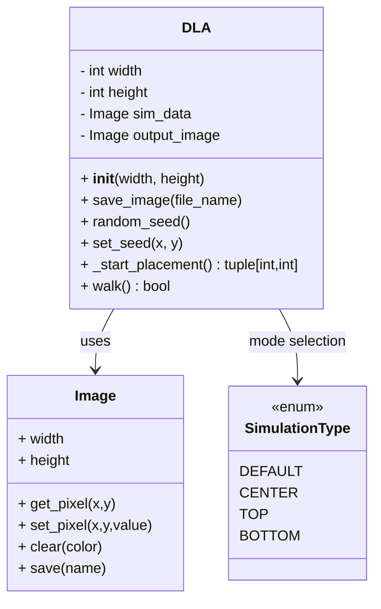
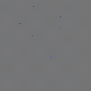
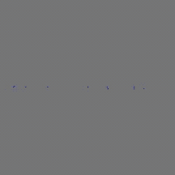
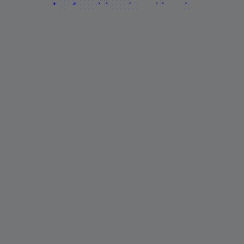
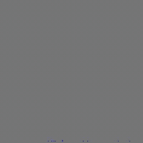

# Diffusion Limited Aggregation (DLA) Simulation

This project implements a DLA simulation in Python.

The simulation uses a custom pixel-based Image class and produces a sequence of PNG frames showing aggregation over time.

---



---

# Demos

This section describes each demo function and provides space for example videos.

## `SimulationType.DEFAULT`

**Description:**

Places random seeds throughout the simulation grid.
This creates natural, chaotic DLA growth patterns where branches compete and merge across the entire image.

**Example Command:**

```
./main.py -o ~/path/to/directoy/ -n "Output" -w 200 -ht 200 -t "default"
```

**Example Output:**



---

## `SimulationType.CENTER`

**Description:**

Places a horizontal line of seeds across the center of the image.
This produces symmetric growth patterns as walkers attach from both the top and bottom, creating structures similar to frost spreading along a cold surface.

**Example Command:**

`./main.py -o ~/path/to/directory/ -n "Output" -w 200 -ht 200 -t "center"`

**Example Output:**



---

## `SimulationType.TOP`

**Description:**

Places seeds along the top row of the simulation grid.
Walkers start from random interior positions and attach as they drift upward, producing downward-branching structures resembling inverted trees, lightning forks, or stalactites.

**Example Command:**

`./main.py -o ~/path/to/directory/ -n "Output" -w 200 -ht 200 -t "top"`

**Example Output:**



---

## `SimulationType.BOTTOM`

**Description:**

Places seeds along the bottom row of the simulation grid.
Walkers attach as they diffuse downward, generating upward-growing fractal formations similar to coral, stalagmites, or plant-like branching from the ground up.

**Example Command:**

`./main.py -o ~/path/to/directory/ -n "Output" -w 200 -ht 200 -t "bottom"`

**Example Output:**



